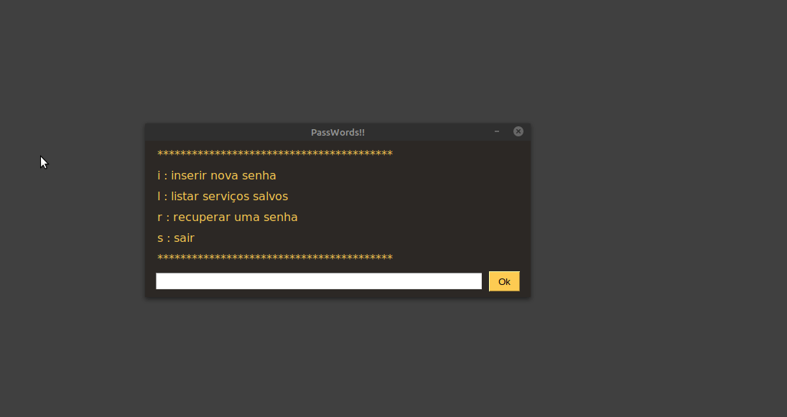
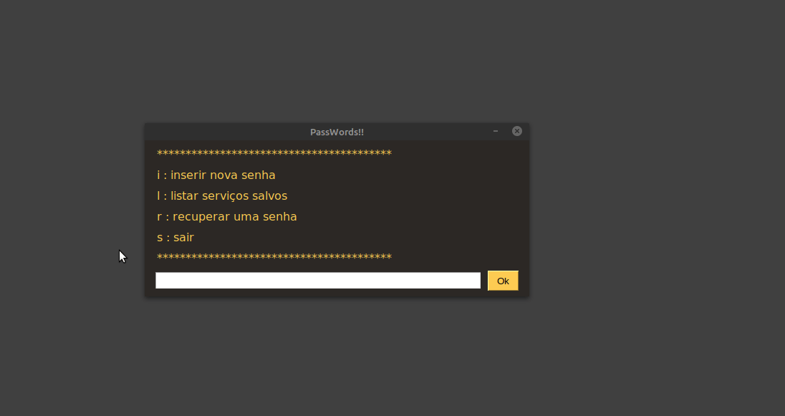

<h1>O que é?</h1>

Uma simples aplicação em python para armazenar serviços, senhas e usuários

<h1>Por que?</h1>

Além da utilídade descrita acima, também hávia uma desejo por minha parte de praticar.

<h1>Como funciona?</h1>

digite no terminal : <mark>| python3 main.py |<mark>

<h2>Registrar :</h2>

<h2>Listar Registros :</h2>

<h2>Recuperar Senhas registradas:</h2>

<h2>Sair :</h2>

